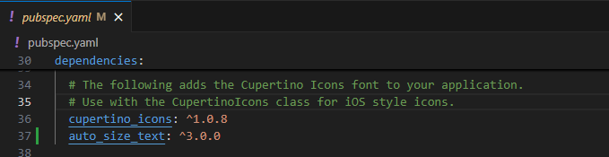
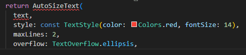
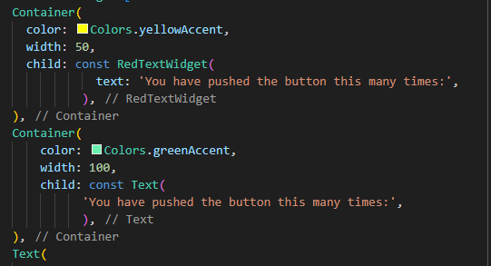
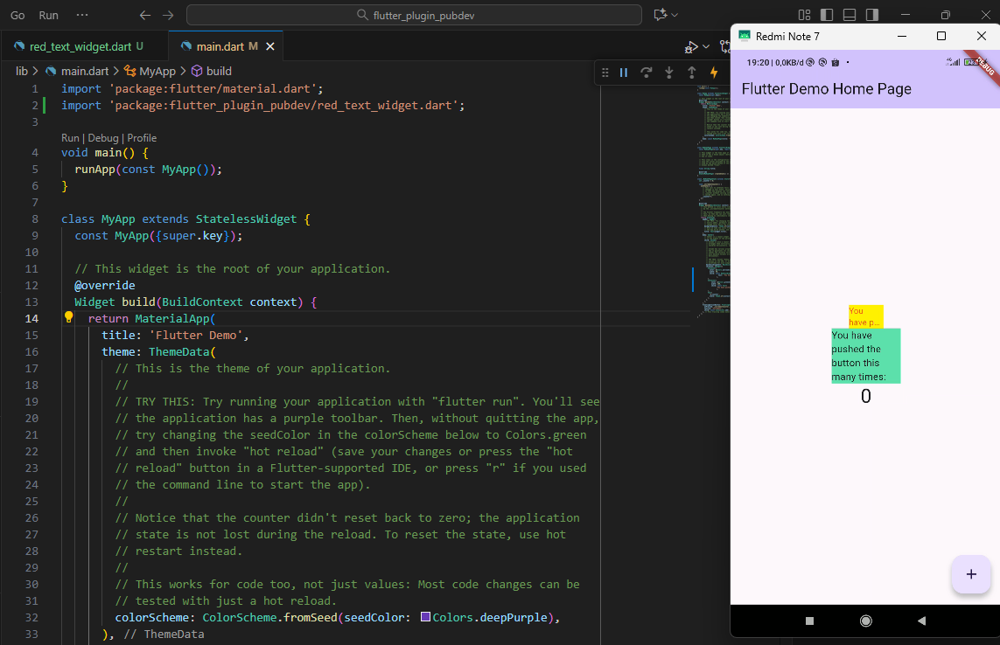

# 🧩 Praktikum Flutter Plugin di Project Flutter (Jobsheet 7)
**Mata Kuliah:** Pemrograman Mobile  
**Nama:** Queenadhynar Azarine Dwipa Andiyani  
**NIM:** 2341760109  
**Kelas:** SIB 3C  

---

## 📘 Deskripsi
Pada praktikum ini, mahasiswa diminta untuk menerapkan penggunaan **plugin `auto_size_text`** pada project Flutter dengan nama `flutter_plugin_pubdev`.  
Plugin ini berfungsi untuk membuat teks agar **menyesuaikan ukuran font secara otomatis** berdasarkan ruang yang tersedia di layar.

---

## 🧱 Langkah-langkah Praktikum

### 🔹 Langkah 1
Membuat project baru bernama `flutter_plugin_pubdev` dan menghubungkannya ke repository GitHub dengan nama yang sama.

### 🔹 Langkah 2
Menambahkan plugin `auto_size_text` menggunakan perintah berikut di terminal:
```bash
flutter pub add auto_size_text
```
📸 **Screenshot:**  
[Langkah2]
(assets/1.png)
(assets/1.1.png)

Jika berhasil, maka plugin akan muncul di file `pubspec.yaml` bagian `dependencies`.

🧠 **Tujuan:**  
Untuk mengintegrasikan plugin eksternal dari pub.dev agar dapat digunakan di project Flutter.

📸 **Screenshot:**  


---

### 🔹 Langkah 3
Membuat file baru bernama `red_text_widget.dart` di dalam folder `lib`, kemudian menambahkan kode berikut:

```dart
import 'package:flutter/material.dart';
import 'package:auto_size_text/auto_size_text.dart';

class RedTextWidget extends StatelessWidget {
  final String text;

  const RedTextWidget({Key? key, required this.text}) : super(key: key);

  @override
  Widget build(BuildContext context) {
    return AutoSizeText(
      text,
      style: const TextStyle(color: Colors.red, fontSize: 14),
      maxLines: 2,
      overflow: TextOverflow.ellipsis,
    );
  }
}
```

🧠 **Penjelasan Error:**  
Error muncul karena variabel `text` belum didefinisikan dan library `auto_size_text` belum diimport.

📸 **Screenshot:**  


---

### 🔹 Langkah 4
Mengubah `return Container()` menjadi `AutoSizeText(...)` untuk menampilkan teks otomatis sesuai ukuran tampilan.

📸 **Screenshot:**  


---

### 🔹 Langkah 5
Menambahkan widget `RedTextWidget` ke dalam `children:` pada class `_MyHomePageState` di file `main.dart`:

```dart
children: const [
  RedTextWidget(text: "Hello Flutter!"),
],
```

🧠 **Tujuan:**  
Untuk menampilkan hasil dari widget kustom yang sudah dibuat di layar utama aplikasi.

📸 **Screenshot:**  

